# APS Performance Assistant

<p align="center">
  
</p>

<p align="center">
  <a href="https://opensource.org/licenses/MIT"></a>
  <a href="https://nextjs.org/"></a>
  <a href="https://fastapi.tiangolo.com/"></a>
  <a href="https://www.python.org/"></a>
  <a href="https://cloud.google.com/run"></a>
</p>

A sophisticated AI-powered assistant designed to help Australian Public Service (APS) employees navigate their career advancement. Leveraging the **APS Integrated Leadership System (ILS)** and **Work Level Standards (WLS)**, this tool provides evidence-based coaching, gap analysis, and rigorous assessment support.

---

## 🚀 Features

-   **Gap Analysis Engine**: Instantly compares your current behaviors against target APS level standards.
-   **Deep Reasoning AI**: Uses advanced chain-of-thought (CoT) reasoning to provide nuanced, context-aware advice.
-   **Evidence-Based Coaching**: All responses are grounded in the official ILS and WLS frameworks—no hallucinations.
-   **Canvas Interface**: A dedicated workspace for drafting pitches, analyzing documents, and refining STAR examples.
-   **Secure & Private**: Enterprise-grade authentication and data handling.

---

## 🏗️ Architecture

The system is built on a modern microservices architecture, separating the high-performance React frontend from the intelligent Python backend.

```mermaid
graph TD
    User[👤 User] -->|HTTPS| FE[Frontend - Next.js]
    FE -->|REST API| BE[Backend - FastAPI]

    subgraph Backend Services
        BE --> Auth[🔐 Auth Service]
        BE --> Agent[🤖 PydanticAI Agent]
        Agent --> RAG[📚 Cognee RAG]
    end

    subgraph Data Layer
        Auth --> DB[(🗄️ Neon Postgres)]
        RAG --> Vec[(Vector Store)]
        RAG --> Docs[ILS Framework]
    end
```



## 🛠️ Tech Stack

### Frontend
-   **Framework**: Next.js 14 (App Router)
-   **Styling**: Tailwind CSS, Framer Motion
-   **Components**: Aceternity UI, Custom Glassmorphism System
-   **State**: React Context API

### Backend
-   **Framework**: FastAPI
-   **AI Orchestration**: LangGraph, PydanticAI
-   **RAG Engine**: Cognee
-   **Database**: PostgreSQL (Neon Cloud), SQLAlchemy (Async)
-   **LLM**: OpenAI GPT-4o / Google Gemini 1.5 Pro

---

## 🏁 Getting Started

### Prerequisites
-   Node.js 18+
-   Python 3.10+
-   PostgreSQL Database (or Neon account)
-   OpenAI/Google API Keys

### Installation

1.  **Clone the repository**
    ```bash
    git clone https://github.com/Verridian-ai/APS-Performance-Assistant.git
    cd APS-Performance-Assistant
    ```

2.  **Backend Setup**
    ```bash
    cd backend
    python -m venv venv
    # Windows:
    .\venv\Scripts\activate
    # Mac/Linux:
    source venv/bin/activate
    
    pip install -r requirements.txt
    ```
    
    Create a `.env` file in `backend/` based on `.env.example`.

3.  **Frontend Setup**
    ```bash
    cd ../frontend
    npm install
    ```

### Running Locally

1.  **Start Backend**
    ```bash
    # In backend/ terminal
    uvicorn app.main:app --reload --port 8000
    ```

2.  **Start Frontend**
    ```bash
    # In frontend/ terminal
    npm run dev
    ```

3.  Visit `http://localhost:3000`

---

## ☁️ Deployment (Google Cloud Run)

This project includes Dockerfiles for easy containerization.

### 1. Build Containers
```bash
# Backend
docker build -t gcr.io/[PROJECT_ID]/aps-backend ./backend

# Frontend
docker build -t gcr.io/[PROJECT_ID]/aps-frontend ./frontend
```

### 2. Deploy
```bash
# Deploy Backend
gcloud run deploy aps-backend --image gcr.io/[PROJECT_ID]/aps-backend --platform managed

# Deploy Frontend
gcloud run deploy aps-frontend --image gcr.io/[PROJECT_ID]/aps-frontend --platform managed
```

See [DEPLOYMENT.md](DEPLOYMENT.md) for detailed instructions including secret management and domain configuration.

---

## 🤝 Contributing

We welcome contributions! Please see [CONTRIBUTING.md](CONTRIBUTING.md) for details on our code of conduct and the process for submitting pull requests.

## 📄 License

This project is licensed under the MIT License - see the [LICENSE](LICENSE) file for details.