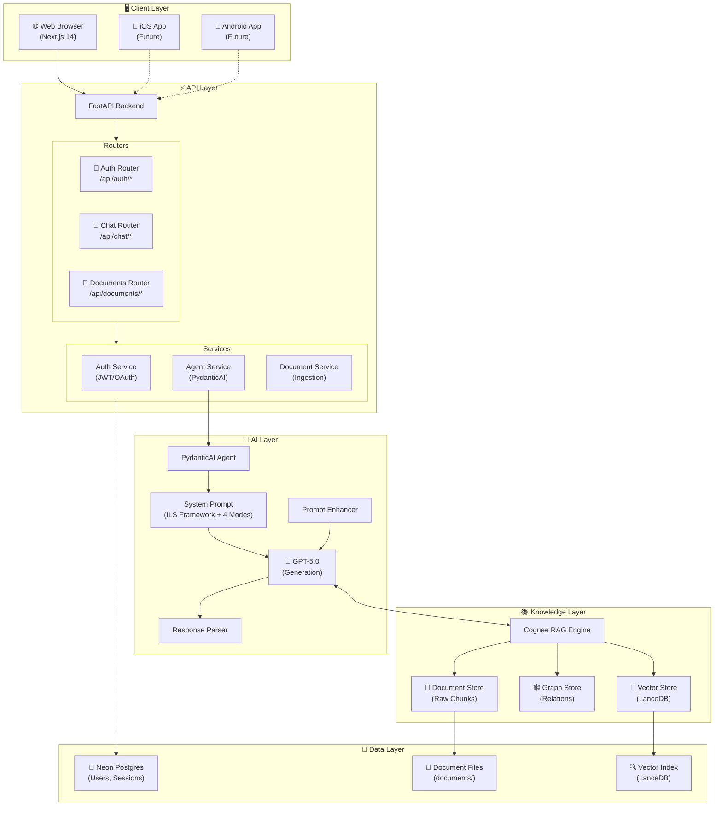
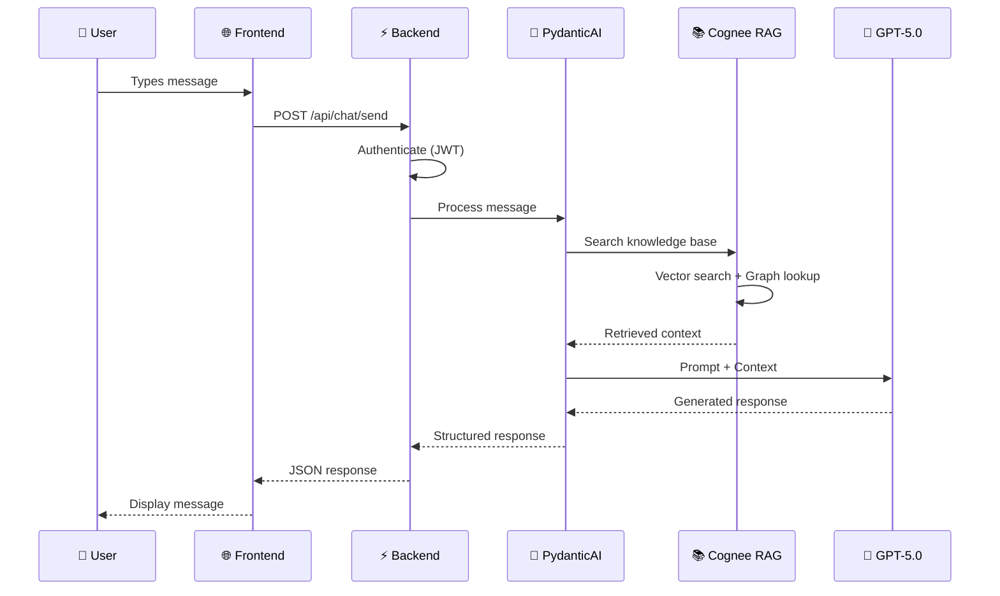
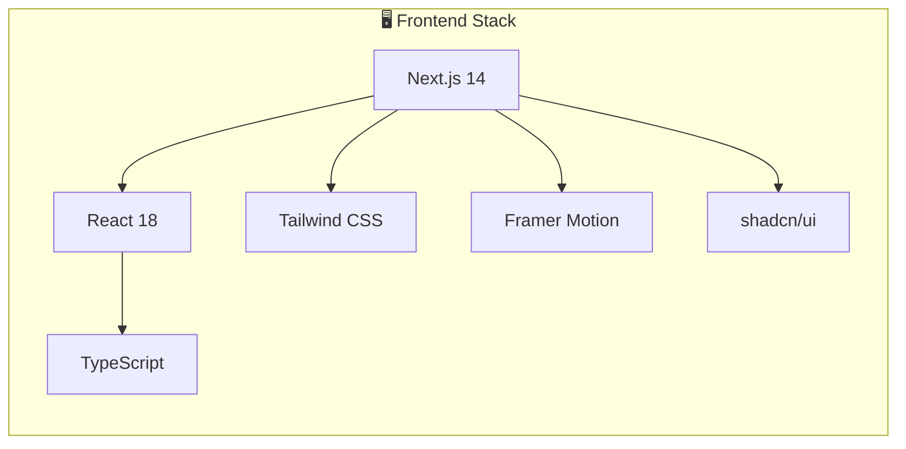
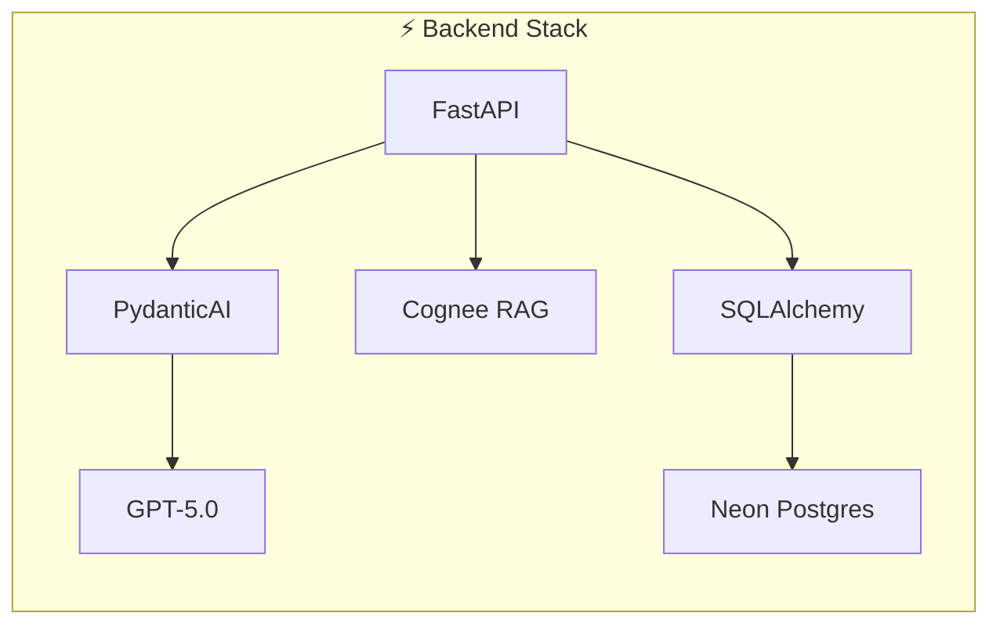
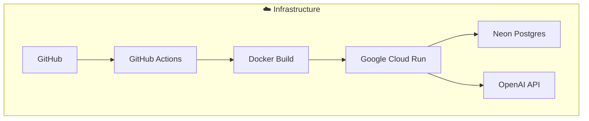
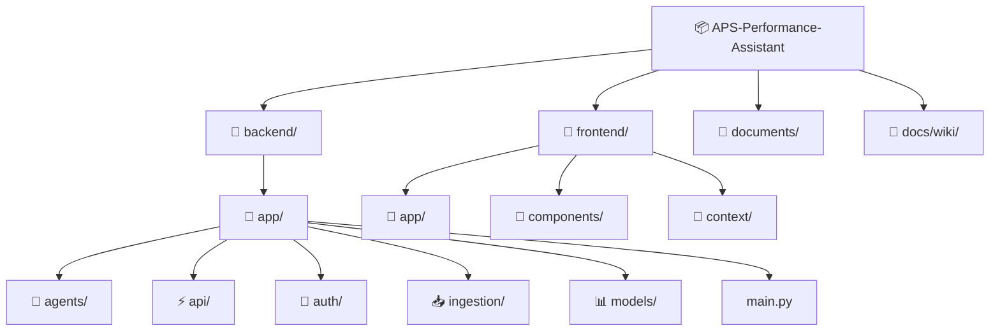
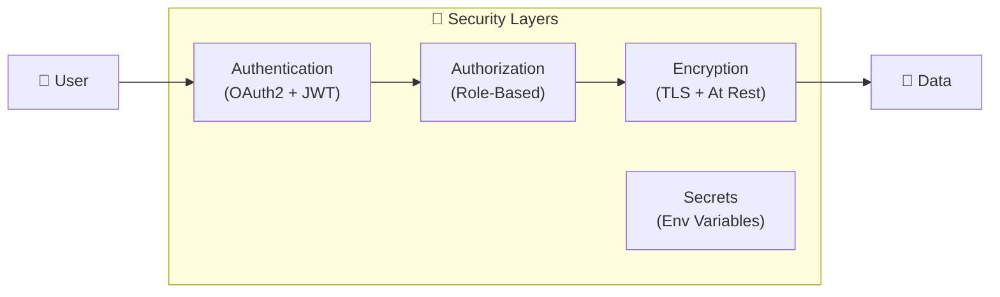
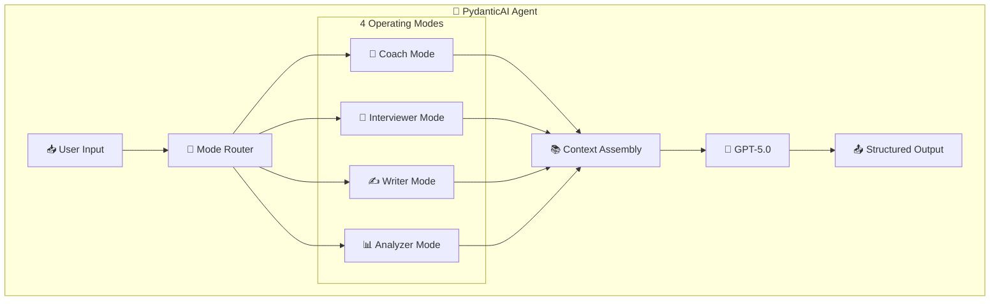

# Architecture Overview

This document describes the technical architecture of the APS Performance Assistant.

---

## 🏗️ System Architecture



---

## 🔄 Request Flow



---

## 🔧 Technology Stack

### Frontend



| Technology | Purpose |
|------------|---------|
| **Next.js 14** | React framework with App Router |
| **TypeScript** | Type safety |
| **Tailwind CSS** | Styling |
| **Framer Motion** | Animations |
| **shadcn/ui** | UI components |

### Backend



| Technology | Purpose |
|------------|---------|
| **FastAPI** | Python web framework |
| **PydanticAI** | Structured AI agent framework |
| **Cognee** | RAG engine with knowledge graphs |
| **SQLAlchemy** | ORM for database access |
| **JWT** | Authentication tokens |

### AI/ML

| Technology | Purpose |
|------------|---------|
| **GPT-5.0** | Main language model (via PydanticAI) |
| **text-embedding-3-large** | Document embeddings |
| **LanceDB** | Vector storage |

### Infrastructure



| Technology | Purpose |
|------------|---------|
| **Neon** | Serverless Postgres |
| **Google Cloud Run** | Container hosting |
| **Docker** | Containerization |
| **GitHub Actions** | CI/CD |

---

## 📁 Project Structure



```
APS-Performance-Assistant/
├── backend/
│   ├── app/
│   │   ├── agents/           # PydanticAI agent logic
│   │   ├── api/              # REST endpoints
│   │   ├── auth/             # Authentication
│   │   ├── ingestion/        # Document processing
│   │   ├── models/           # Database models
│   │   └── main.py           # FastAPI app
│   ├── Dockerfile
│   └── requirements.txt
├── frontend/
│   ├── app/                  # Next.js pages
│   ├── components/           # React components
│   ├── context/              # State management
│   └── package.json
├── documents/                # Source documents
├── docs/wiki/                # Documentation
└── .env.example
```

---

## 🔐 Security Architecture



- **Authentication**: OAuth2 + JWT tokens
- **Authorization**: Role-based access control
- **Data**: Encrypted at rest and in transit
- **Secrets**: Environment variables, never in code

---

## 🧠 AI Agent Architecture



