# Cognee RAG Engine

This document explains how the APS Performance Assistant uses Cognee for Retrieval-Augmented Generation (RAG).

---

## 🧠 What is RAG?

**Retrieval-Augmented Generation (RAG)** is a technique that combines:
1. **Retrieval**: Finding relevant information from a knowledge base
2. **Generation**: Using an LLM to generate responses based on that information

```mermaid
flowchart LR
    subgraph RAG["🧠 RAG Process"]
        Q["📝 User Query"] --> R["🔍 Retrieve"]
        R --> C["📚 Context"]
        C --> G["🤖 Generate"]
        G --> A["💬 Answer"]
    end

    KB["📖 Knowledge Base"] --> R
    LLM["🧠 GPT-5.0"] --> G
```



This ensures the AI's responses are grounded in factual source material, not just its training data.

---

## 📚 How Cognee Works

Cognee is an advanced RAG engine that goes beyond simple vector search by building a **knowledge graph** of relationships between concepts.

### The Three Storage Layers

```mermaid
flowchart TB
    subgraph Cognee["📚 Cognee Architecture"]
        direction TB

        subgraph DocStore["📄 Document Store"]
            DS["Raw text chunks from source documents"]
        end

        subgraph VectorStore["🧮 Vector Store (LanceDB)"]
            VS["Semantic embeddings for similarity search<br/>using text-embedding-3-large"]
        end

        subgraph GraphStore["🕸️ Graph Store (PostgreSQL)"]
            GS["Entity relationships<br/>APS Level → Capability → Behavioral Indicator"]
        end
    end

    DocStore --> VectorStore
    VectorStore --> GraphStore
```



---

## 🔄 Document Processing Pipeline

When you run the ingestion pipeline, here's what happens:

```mermaid
flowchart LR
    subgraph Pipeline["📥 Ingestion Pipeline"]
        direction LR
        PARSE["1️⃣ Parse<br/>Documents"] --> CHUNK["2️⃣ Chunk<br/>Text"]
        CHUNK --> EMBED["3️⃣ Embed<br/>Vectors"]
        EMBED --> EXTRACT["4️⃣ Extract<br/>Entities"]
        EXTRACT --> RELATE["5️⃣ Build<br/>Relations"]
    end

    PDF["📄 PDF"] --> PARSE
    DOCX["📝 DOCX"] --> PARSE
    TXT["📃 TXT"] --> PARSE

    RELATE --> DB[(💾 Database)]
```



### Step 1: Document Parsing
```python
# Supported formats
files = ["*.pdf", "*.docx", "*.doc", "*.txt", "*.md"]
```

The parser extracts text from:
- APS Level Profiles (APS1-SES3)
- Self-Assessment Tools
- Comparative Guides
- Broadband Workbooks

### Step 2: Chunking
Documents are split into semantic chunks of ~500 tokens each, with overlap to maintain context.

### Step 3: Embedding
Each chunk is converted to a 3072-dimensional vector using OpenAI's `text-embedding-3-large` model.

### Step 4: Graph Extraction
Cognee analyzes the text to extract:

| Entity Type | Example |
|-------------|---------|
| APS Level | "APS 4", "EL 1", "SES Band 2" |
| Capability Cluster | "Shapes Strategic Thinking" |
| Specific Capability | "Inspires a sense of purpose" |
| Behavioral Indicator | "Translates goals into actionable tasks" |

### Step 5: Relationship Building

```mermaid
graph LR
    APS["🎯 APS Level"] -->|requires| CC["📦 Capability Cluster"]
    CC -->|contains| SC["⭐ Specific Capability"]
    SC -->|demonstrated_by| BI["📋 Behavioral Indicator"]
    BI -->|is_critical_for| APS
```



---

## 🔍 Query Processing

When a user asks a question:

```mermaid
sequenceDiagram
    participant U as 👤 User
    participant E as 🔢 Embedder
    participant V as 🧮 Vector Store
    participant G as 🕸️ Graph Store
    participant L as 🧠 GPT-5.0

    U->>E: "What capabilities for APS 5?"
    E->>E: Generate embedding
    E->>V: Similarity search
    V-->>E: Top 5 chunks
    E->>G: Graph lookup
    G-->>E: Related entities
    E->>L: Context + Query
    L-->>U: Grounded response
```



### 1. Semantic Search

```mermaid
flowchart TB
    QUERY["📝 User Query:<br/>'What capabilities do I need for APS 5?'"]
    EMBED["🔢 Embed Query"]
    VECTOR["🧮 Vector Search"]
    GRAPH["🕸️ Graph Lookup"]
    CHUNKS["📄 Top 5 Similar Chunks"]
    ENTITIES["🔗 Related Entities"]

    QUERY --> EMBED
    EMBED --> VECTOR
    VECTOR --> CHUNKS
    VECTOR --> GRAPH
    GRAPH --> ENTITIES
```



### 2. Context Assembly
The system combines:
- Relevant text chunks from vector search
- Related entities from the knowledge graph
- User's current and target APS level

### 3. Prompt Augmentation
```python
prompt = f"""
{SYSTEM_PROMPT}

### Retrieved ILS Knowledge (Source of Truth)
{retrieved_context}

### User Query
{user_question}
"""
```

### 4. LLM Generation
GPT-5.0 generates a response grounded in the retrieved context.

---

## 🕸️ Knowledge Graph Structure

```mermaid
graph TB
    subgraph ILS["📚 ILS Framework"]
        APS1["APS 1"]
        APS2["APS 2"]
        APS3["APS 3"]
        APS4["APS 4"]
        APS5["APS 5"]
        APS6["APS 6"]
        EL1["EL 1"]
        EL2["EL 2"]
    end

    subgraph Clusters["📦 Capability Clusters"]
        SST["Shapes Strategic<br/>Thinking"]
        AR["Achieves<br/>Results"]
        EPI["Exemplifies Personal<br/>Integrity"]
        CPWR["Cultivates Productive<br/>Working Relationships"]
        CWI["Communicates<br/>with Influence"]
    end

    APS5 --> SST
    APS5 --> AR
    APS5 --> EPI
    APS5 --> CPWR
    APS5 --> CWI

    SST --> CAP1["Inspires a sense<br/>of purpose"]
    SST --> CAP2["Focuses strategically"]
    AR --> CAP3["Delivers results"]
```



---

## 📥 Adding New Documents

### Manual Ingestion
```bash
cd backend
python -m app.ingestion.pipeline_v2
```

### Custom Documents
Add your documents to the `documents/` folder:
```
documents/
├── APS1_Profile_ILS.pdf      # Official profiles
├── APS2_Profile_ILS.pdf
├── Custom_Policy.pdf          # Your custom docs
└── Department_Guidelines.docx
```

Then run ingestion again.

---

## ⚙️ Configuration

### Environment Variables
```env
# LLM Settings
LLM_PROVIDER=openai
LLM_MODEL=gpt-5.0
OPENAI_API_KEY=sk-...

# Embedding Settings
EMBEDDING_PROVIDER=openai
EMBEDDING_MODEL=text-embedding-3-large

# Database
DB_PROVIDER=postgres
DB_CONNECTION_STRING=postgresql+asyncpg://...
```

---

## 🔬 Debugging

### Check Cognee Status
```python
import cognee
await cognee.status()
```

### View Knowledge Graph
```python
# Search the graph
results = await cognee.search("APS 4 capabilities", search_type=SearchType.GRAPH)
```

---

## 📊 Performance Tips

```mermaid
graph LR
    subgraph Tips["⚡ Performance Optimization"]
        BATCH["📦 Batch Documents"] --> FASTER["Faster Ingestion"]
        SSD["💾 Use SSD Storage"] --> FASTER
        RAM["🧠 Increase Memory"] --> FASTER
        GPU["🎮 GPU Acceleration"] --> FASTER
    end
```



1. **Batch Documents**: Ingest multiple files at once
2. **Use SSD Storage**: Vector operations are I/O intensive
3. **Increase Memory**: Large document sets need more RAM
4. **GPU Acceleration**: Enable CUDA for faster embeddings

