# Document Ingestion Guide

This guide explains how to add new documents to the APS Performance Assistant knowledge base.

---

## 📊 Overview

```mermaid
flowchart LR
    subgraph Input["📄 Input"]
        PDF["PDF Files"]
        DOCX["Word Docs"]
        TXT["Text Files"]
    end

    subgraph Pipeline["⚙️ Ingestion Pipeline"]
        PARSE["1. Parse"]
        CHUNK["2. Chunk"]
        EMBED["3. Embed"]
        GRAPH["4. Graph"]
    end

    subgraph Output["💾 Knowledge Base"]
        VECTOR["Vector Store"]
        KNOWLEDGE["Knowledge Graph"]
    end

    Input --> PARSE --> CHUNK --> EMBED --> GRAPH --> Output
```



---

## 📁 The Documents Folder

All source documents are stored in the `documents/` folder at the project root:

```mermaid
flowchart TB
    subgraph Docs["📁 documents/"]
        APS["📄 APS Profiles<br/>APS1-APS6_Profile_ILS.pdf"]
        EL["📄 EL Profiles<br/>EL1-EL2_Profile_ILS.pdf"]
        SES["📄 SES Profiles<br/>SES1-SES3_Profile_ILS.pdf"]
        TOOLS["📄 Tools<br/>ILS_SelfAssessment_Tool.pdf<br/>ILS_Comparative_Guide.pdf"]
    end
```



---

## 📥 Adding New Documents

```mermaid
flowchart LR
    A["1️⃣ Prepare<br/>Documents"] --> B["2️⃣ Copy to<br/>Folder"]
    B --> C["3️⃣ Run<br/>Pipeline"]
    C --> D["4️⃣ Verify<br/>Success"]
```



### Step 1: Prepare Your Documents

Ensure your documents are in a supported format:

| Format | Extension | Notes |
|--------|-----------|-------|
| PDF | `.pdf` | Best for official documents |
| Word | `.docx`, `.doc` | For editable templates |
| Text | `.txt` | Plain text files |
| Markdown | `.md` | For structured content |

### Step 2: Copy to Documents Folder

```bash
# Copy a single file
cp /path/to/your/document.pdf documents/

# Copy multiple files
cp /path/to/folder/*.pdf documents/
```

### Step 3: Run the Ingestion Pipeline

```bash
cd backend

# Activate virtual environment
source venv/bin/activate  # or .\venv\Scripts\activate on Windows

# Run ingestion
python -m app.ingestion.pipeline_v2
```

### Step 4: Verify Ingestion

The pipeline will output progress:

```
✓ Loaded 15 documents
✓ Created 342 chunks
✓ Generated 342 embeddings
✓ Extracted 89 entities
✓ Built 156 relationships
✓ Ingestion complete!
```

## 🔄 Re-Ingesting Documents

```mermaid
flowchart LR
    subgraph Options["🔄 Re-ingestion Options"]
        FULL["🔄 Full Reset<br/>--reset flag"]
        INCR["➕ Incremental<br/>--incremental flag"]
    end

    FULL --> RESULT1["Clears & rebuilds<br/>entire knowledge base"]
    INCR --> RESULT2["Only processes<br/>new files"]
```



To update the knowledge base after modifying documents:

```bash
# Option 1: Full re-ingestion (recommended)
python -m app.ingestion.pipeline_v2 --reset

# Option 2: Incremental (only new files)
python -m app.ingestion.pipeline_v2 --incremental
```

---

## 📋 Document Recommendations

```mermaid
flowchart TB
    subgraph Include["✅ DO Include"]
        ILS["📄 ILS Profiles"]
        WLS["📄 Work Level Standards"]
        DEPT["📄 Department Frameworks"]
        ROLE["📄 Role Descriptions"]
        BROAD["📄 Broadband Guides"]
    end

    subgraph Exclude["❌ DON'T Include"]
        PERF["🚫 Personal Reviews"]
        HR["🚫 Confidential HR Docs"]
        PII["🚫 Documents with PII"]
        UNRELA["🚫 Unrelated Policies"]
    end
```



### Best Practices

✅ **DO include:**
- Official APS ILS Profile documents
- Work Level Standards (WLS)
- Department-specific capability frameworks
- Role descriptions and duty statements
- Broadband advancement guides

❌ **DON'T include:**
- Personal performance reviews
- Confidential HR documents
- Documents with PII (personally identifiable information)
- Unrelated policy documents

### Document Quality Tips

1. **Clear Text**: Ensure PDFs have searchable text (not scanned images)
2. **Good Structure**: Documents with headings work better
3. **Relevant Content**: Only include APS performance-related material
4. **Version Control**: Use the latest versions of framework documents

## 🔧 Troubleshooting


### "No documents found"
```bash
# Check the documents folder
ls documents/

# Verify file permissions
chmod 644 documents/*
```

### "Failed to parse PDF"
- Ensure the PDF contains text (not scanned images)
- Try converting to a newer PDF format
- Use OCR software first if needed

### "Embedding failed"
- Check your OpenAI API key is valid
- Ensure you have API credits
- Verify network connectivity

### "Database connection error"
- Verify DATABASE_URL in .env
- Check PostgreSQL is running
- Test connection manually

## 🔬 Advanced: Custom Ingestion

For custom document processing, edit `backend/app/ingestion/pipeline_v2.py`:

```python
# Example: Add custom metadata extraction
async def process_documents():
    documents_path = Path(__file__).parent.parent.parent.parent / "documents"
    
    for file_path in documents_path.glob("*.pdf"):
        # Custom processing logic
        metadata = extract_aps_level(file_path.name)
        await cognee.add(str(file_path), metadata=metadata)
```

## 📊 Monitoring

### Check Ingestion Status
```python
import cognee
status = await cognee.status()
print(f"Documents: {status['document_count']}")
print(f"Embeddings: {status['embedding_count']}")
```

### View Indexed Content
```python
results = await cognee.search("APS 4", search_type=SearchType.CHUNKS)
for chunk in results:
    print(chunk.text[:200])
```

