# Example Prompts

This page provides example prompts to help you get the most out of the APS Performance Assistant.

---

## 🗺️ Prompt Categories

```mermaid
flowchart TB
    subgraph Categories["📚 Prompt Categories"]
        GOALS["📝 Writing<br/>Performance Goals"]
        GAP["📊 Gap<br/>Analysis"]
        STAR["✍️ STAR<br/>Examples"]
        CAP["🎯 Capability<br/>Understanding"]
        CAREER["🚀 Career<br/>Advancement"]
        REVIEW["📋 Document<br/>Review"]
    end
```



---

## 📝 Writing Performance Goals

### SMART Goals
```
Help me write 3 SMART goals for my APS 5 performance agreement focused on 
"Achieves Results" capability.
```

```
I need to set goals for my first year as an EL1. What key capabilities 
should I focus on?
```

```
Can you help me align my team's goals with the "Shapes Strategic Thinking" 
capability cluster?
```

## 📊 Gap Analysis

### Level Comparison
```
What's the difference between APS 4 and APS 5 in terms of 
"Cultivates Productive Working Relationships"?
```

```
I'm an APS 6 aiming for EL1. What are the biggest capability gaps I 
need to address?
```

```
Compare the leadership expectations between EL1 and EL2 levels.
```

### Self-Assessment
```
Review this draft self-assessment for "Supports Strategic Direction" 
at APS 4 level:

"I attended team meetings and supported my manager's decisions."
```

```
Is this evidence strong enough for APS 5 "Achieves Results"?

"I completed all my assigned tasks on time and helped a colleague 
with their project."
```

## ✍️ Writing STAR Examples

### Starting Fresh
```
Help me write a STAR example for "Stewards Integrity and Ethical 
Conduct" at APS 6 level.
```

```
I need to demonstrate "Manages Uncertainty" at EL1. Can you give me 
a template to follow?
```

### Improving Drafts
```
Improve this STAR example to better demonstrate APS 5 level work:

Situation: We had a busy period at work.
Task: I needed to help the team.
Action: I worked hard and stayed late.
Result: We finished the project.
```

## 🎯 Capability Understanding

### Specific Capabilities
```
What does "Inspires a sense of purpose" look like at EL2 level?
```

```
Explain the behavioral indicators for "Nurtures internal and external 
relationships" at APS 5.
```

```
How is "strategic thinking" demonstrated differently at APS 6 vs EL1?
```

### Capability Clusters
```
Break down the "Achieves Results" capability cluster for APS 4 level.
```

```
What are all the capabilities in "Cultivates Productive Working 
Relationships"?
```

## 🚀 Career Advancement

### Broadband Progression
```
I'm preparing for broadband advancement from APS 4 to APS 5. 
What evidence do I need?
```

```
What's the typical timeline and process for advancing from 
APS 6 to EL1?
```

### Interview Preparation
```
What questions might I be asked in an EL1 interview about 
"Shapes Strategic Thinking"?
```

```
Help me prepare for a panel interview for APS 6 level. What 
capabilities should I be ready to discuss?
```

## 📋 Document Review

### Reviewing Your Work
```
Review my performance agreement draft and identify any gaps 
against APS 5 expectations:

[paste your document]
```

```
Is this duty statement appropriate for an APS 4 role?

[paste duty statement]
```

### Professional Language
```
Make this more professional for my self-assessment:

"I basically ran the whole project because my manager was 
away a lot."
```

```
Translate this casual description into APS-appropriate language:

"I fixed up the team's problems and made everyone work better 
together."
```

## ❓ General Questions

```
What is the Integrated Leadership System (ILS)?
```

```
How many capability clusters are there and what are they?
```

```
What's the difference between a capability and a behavioral indicator?
```

```
How do I use the ILS Self-Assessment Tool?
```

## 💡 Tips for Better Prompts

```mermaid
flowchart LR
    subgraph Tips["💡 Better Prompts"]
        T1["1️⃣ Specify<br/>your level"]
        T2["2️⃣ Include<br/>context"]
        T3["3️⃣ Ask for<br/>specifics"]
        T4["4️⃣ Iterate<br/>& refine"]
        T5["5️⃣ Share<br/>drafts"]
    end

    T1 --> T2 --> T3 --> T4 --> T5
```



1. **Specify your level**: Always mention your current and target APS level
2. **Include context**: Share what you're working on
3. **Ask for specifics**: Request behavioral indicators or examples
4. **Iterate**: Ask follow-up questions to refine responses
5. **Share drafts**: Get feedback on your actual work

