# Frequently Asked Questions

---

## General Questions

### What is the APS Performance Assistant?

```mermaid
flowchart LR
    USER["👤 APS Employee"] --> APP["🤖 APS Performance<br/>Assistant"]
    APP --> ILS["📚 ILS Framework"]
    APP --> GPT["🧠 GPT-5.0"]
    APP --> HELP["✅ Career Guidance"]
```

The APS Performance Assistant is an AI-powered tool that helps Australian Public Service employees with career advancement. It uses the official Integrated Leadership System (ILS) framework to provide guidance on performance goals, self-assessments, and capability development.

### Who is this tool for?

```mermaid
flowchart TB
    subgraph Users["👥 Target Users"]
        APS["👤 APS Employees<br/>(APS 1 - SES)"]
        LEAD["👤 Team Leaders"]
        HR["👤 HR Professionals"]
        BROAD["👤 Broadband Candidates"]
    end
```

This tool is designed for:
- APS employees at all levels (APS 1 through SES)
- Team leaders helping staff with performance agreements
- HR professionals supporting capability development
- Anyone preparing for broadband advancement

### Is my data secure?
Yes. Your conversations are stored securely with encryption. We do not share data with third parties, and you can delete your conversation history at any time.

## Using the Assistant

### What can I ask the assistant?
You can ask about:
- Writing SMART performance goals
- Understanding capability requirements for any APS level
- Drafting STAR examples for specific capabilities
- Comparing different APS levels
- Improving draft self-assessments
- Preparing for broadband advancement

### How accurate are the responses?
All responses are grounded in the official ILS framework documents. The AI retrieves relevant information from these documents before generating responses. However, you should always review AI output and verify against official sources.

### Can I use the AI output directly in my performance agreement?
The AI provides drafts and suggestions that you should review and personalize. Never submit AI-generated content without:
1. Verifying accuracy
2. Adding your personal examples
3. Adapting the language to your context
4. Ensuring it reflects your actual work

### Why does the AI sometimes ask questions instead of giving answers?
The assistant uses an "Interviewer Mode" when you need help discovering evidence. By asking targeted questions, it helps you recall specific situations from your experience that demonstrate the capability you're working on.

## Technical Questions

### What browser works best?
The application works on all modern browsers:
- Chrome (recommended)
- Firefox
- Safari
- Edge

### Can I use this on mobile?
Yes, the web application is responsive and works on mobile devices. Native iOS and Android apps are planned for future release.

### Why is the response taking a long time?
Response time depends on:
- The complexity of your question
- The amount of context being retrieved
- Your internet connection
- Server load

Most responses complete within 5-10 seconds.

### Can I delete my conversation history?
Yes. You can delete individual conversations or your entire history from the settings menu.

## ILS Framework Questions

### What is the ILS?

```mermaid
flowchart TB
    subgraph ILS["📚 Integrated Leadership System"]
        APS1["APS 1"] --> APS2["APS 2"] --> APS3["APS 3"]
        APS3 --> APS4["APS 4"] --> APS5["APS 5"] --> APS6["APS 6"]
        APS6 --> EL1["EL 1"] --> EL2["EL 2"] --> SES["SES"]
    end
```

The Integrated Leadership System (ILS) is the Australian Government's capability framework. It defines the skills, knowledge, and behaviors expected at each APS level across five capability clusters.

### What are the five capability clusters?

```mermaid
flowchart LR
    subgraph Clusters["📦 5 Capability Clusters"]
        SST["🎯 Shapes Strategic<br/>Thinking"]
        AR["✅ Achieves<br/>Results"]
        EPI["⭐ Exemplifies Personal<br/>Integrity"]
        CPWR["🤝 Cultivates Productive<br/>Working Relationships"]
        CWI["📢 Communicates<br/>with Influence"]
    end
```

1. **Shapes Strategic Thinking** - Vision, strategy, and innovation
2. **Achieves Results** - Delivery, planning, and accountability
3. **Exemplifies Personal Integrity** - Ethics, self-awareness, and resilience
4. **Cultivates Productive Working Relationships** - Communication and collaboration
5. **Communicates with Influence** - Negotiation and persuasion

### How do capabilities change between levels?

```mermaid
flowchart LR
    subgraph Progression["📈 Level Progression"]
        IND["👤 Individual<br/>Tasks"] --> TEAM["👥 Team<br/>Coordination"]
        TEAM --> ORG["🏢 Organizational<br/>Impact"]
        ORG --> GOV["🏛️ Whole-of-Government<br/>Leadership"]
    end
```

As you progress through APS levels:
- **Scope** increases (individual → team → organization → whole-of-government)
- **Complexity** increases
- **Independence** increases
- **Leadership** expectations increase

### What's the difference between a capability and a behavioral indicator?

```mermaid
flowchart TB
    CAP["📦 Capability<br/>'Achieves Results'"] --> BI1["📋 Behavioral Indicator 1<br/>'Identifies and prioritizes tasks'"]
    CAP --> BI2["📋 Behavioral Indicator 2<br/>'Delivers quality outcomes'"]
    CAP --> BI3["📋 Behavioral Indicator 3<br/>'Manages resources effectively'"]
```

- **Capability**: A broad skill or attribute (e.g., "Achieves Results")
- **Behavioral Indicator**: A specific observable behavior that demonstrates the capability (e.g., "Identifies and prioritizes competing tasks")

## Troubleshooting

### The assistant isn't responding
1. Check your internet connection
2. Refresh the page
3. Try logging out and back in
4. Clear your browser cache

### I got an error message
Take a screenshot of the error and:
1. Note what you were doing when it occurred
2. Check if the issue persists
3. Contact support if the problem continues

### The response doesn't seem relevant
Try:
1. Being more specific in your question
2. Including your current and target APS level
3. Providing more context
4. Breaking complex questions into smaller parts

## Getting Help

### Where can I get more help?
- Review the [[User Guide]] for detailed instructions
- Check [[Example Prompts]] for inspiration
- Visit the [GitHub Issues](https://github.com/Verridian-ai/APS-Performance-Assistant/issues) page
- Contact your system administrator

