# APS Performance Assistant Wiki

  

Welcome to the **APS Performance Assistant** documentation! This wiki provides comprehensive, beginner-friendly guides for users, developers, and administrators.

---

## 🚀 Quick Start

New to the APS Performance Assistant? Start here:

| Step | Guide | Time |
|------|-------|------|
| 1️⃣ | [[Neon-Database-Setup]] - Set up your database | 15 min |
| 2️⃣ | [[OpenAI-Setup]] - Get your API key | 10 min |
| 3️⃣ | [[User-Guide]] - Learn how to use the app | 10 min |

---

## 📚 Documentation Index

### 👤 For Users

| Guide | Description |
|-------|-------------|
| [[User-Guide]] | Complete guide to using the assistant |
| [[Example-Prompts]] | 30+ sample questions organized by use case |
| [[FAQ]] | Frequently asked questions and answers |

### 🔧 Setup Guides

| Guide | Description | Difficulty |
|-------|-------------|------------|
| [[Neon-Database-Setup]] | Set up Neon Postgres database | 🟢 Beginner |
| [[OpenAI-Setup]] | Obtain and configure OpenAI API key | 🟢 Beginner |
| [[Docker-Setup]] | Run with Docker containers | 🟡 Intermediate |
| [[Document-Ingestion]] | Add APS documents to knowledge base | 🟡 Intermediate |

### 🏗️ For Developers

| Guide | Description |
|-------|-------------|
| [[Architecture-Overview]] | System design, tech stack, and data flow |
| [[Cognee-RAG-Engine]] | How the knowledge engine works |
| [[Mobile-Responsiveness]] | Responsive design specifications |

### 📱 Design & UX

| Guide | Description |
|-------|-------------|
| [[Mobile-Responsiveness]] | Breakpoints, touch targets, and PWA features |

---

## 🔗 Quick Links

| Resource | Link |
|----------|------|
| 📂 GitHub Repository | [Verridian-ai/APS-Performance-Assistant](https://github.com/Verridian-ai/APS-Performance-Assistant) |
| 🐛 Report a Bug | [Create Issue](https://github.com/Verridian-ai/APS-Performance-Assistant/issues/new) |
| 📖 README | [View README](https://github.com/Verridian-ai/APS-Performance-Assistant#readme) |

---

## 🎯 What is APS Performance Assistant?

The APS Performance Assistant is an **AI-powered career coach** for Australian Public Service employees. It helps you:

| Feature | Description |
|---------|-------------|
| 📝 **Write Goals** | Create SMART performance goals aligned to ILS |
| 📊 **Gap Analysis** | Compare your capabilities to target APS levels |
| ✍️ **Draft Evidence** | Structure STAR examples for self-assessments |
| 🎯 **Career Planning** | Understand requirements for advancement |
| 🔍 **ILS Guidance** | Get answers grounded in official frameworks |

### Powered by AI + Official Frameworks

```mermaid
flowchart LR
    USER["👤 User"] --> FRONTEND["🌐 Next.js"]
    FRONTEND --> BACKEND["⚡ FastAPI"]
    BACKEND --> AGENT["🤖 PydanticAI"]
    AGENT --> GPT["🧠 GPT-5.0"]
    AGENT --> RAG["📚 Cognee RAG"]
    RAG --> KB["📖 ILS Knowledge Base"]
```

The assistant uses:
- **GPT-5.0** for intelligent conversation (via PydanticAI)
- **Cognee RAG** for retrieval from ILS documents
- **Knowledge Graph** for understanding APS level relationships

---

## 📋 All Wiki Pages

| Page | Category | Description |
|------|----------|-------------|
| [[User-Guide]] | Users | How to use the assistant effectively |
| [[Example-Prompts]] | Users | Sample prompts for every use case |
| [[FAQ]] | Users | Common questions answered |
| [[Neon-Database-Setup]] | Setup | Complete Neon Postgres setup guide |
| [[OpenAI-Setup]] | Setup | OpenAI API key configuration |
| [[Docker-Setup]] | Setup | Docker container deployment |
| [[Document-Ingestion]] | Setup | Adding documents to knowledge base |
| [[Architecture-Overview]] | Developers | System architecture and design |
| [[Cognee-RAG-Engine]] | Developers | RAG engine technical details |
| [[Mobile-Responsiveness]] | Design | Responsive design documentation |

---

## 🆘 Need Help?

1. **Check the [[FAQ]]** for common questions
2. **Search this wiki** for specific topics
3. **Create an issue** on GitHub for bugs or feature requests
4. **Review [[Example-Prompts]]** for inspiration

---

  Made with ❤️ for the Australian Public Service

