# Mobile Responsiveness & Design Guide

> 📱 **Target Devices:** Mobile (320px+), Tablet (768px+), Desktop (1024px+)
> 🎨 **Framework:** Tailwind CSS v3.4
> 📐 **Approach:** Mobile-First Responsive Design

This document provides comprehensive documentation of the responsive design system used in the APS Performance Assistant.

---

## 📑 Table of Contents

1. [Design Philosophy](#-design-philosophy)
2. [Breakpoint System](#-breakpoint-system)
3. [Component Responsiveness](#-component-responsiveness)
4. [Touch & Accessibility](#-touch-targets--accessibility)
5. [Typography Scaling](#-typography-scaling)
6. [Browser Compatibility](#-browser-compatibility)
7. [PWA Features](#-pwa-progressive-web-app-features)
8. [Screenshot Gallery](#-screenshot-gallery)
9. [Testing Guidelines](#-testing-guidelines)

---

## 🎯 Design Philosophy

### Mobile-First Approach

The APS Performance Assistant uses a **Mobile-First** design strategy:

```mermaid
flowchart LR
    subgraph Mobile["📱 Mobile (Default)"]
        M1["Base styles applied first"]
    end

    subgraph Tablet["📱 Tablet (sm: / md:)"]
        T1["Add tablet modifications"]
    end

    subgraph Desktop["🖥️ Desktop (lg: / xl:)"]
        D1["Add desktop enhancements"]
    end

    Mobile --> Tablet --> Desktop
```



**Why Mobile-First?**
| Benefit | Explanation |
|---------|-------------|
| Performance | Mobile devices load only necessary styles |
| Simplicity | Start simple, add complexity |
| Future-proof | Mobile traffic continues to grow |
| Accessibility | Forces focus on core content |

---

## 📏 Breakpoint System

### Tailwind CSS Breakpoints

```mermaid
flowchart LR
    subgraph Breakpoints["📏 Breakpoint Scale"]
        direction LR
        BASE["📱 0px<br/>(base)"] --> SM["📱 640px<br/>(sm:)"]
        SM --> MD["📱 768px<br/>(md:)"]
        MD --> LG["💻 1024px<br/>(lg:)"]
        LG --> XL["🖥️ 1280px<br/>(xl:)"]
        XL --> XXL["🖥️ 1536px<br/>(2xl:)"]
    end
```



| Prefix | Min Width | Typical Devices | Use Case |
|--------|-----------|-----------------|----------|
| (none) | `0px` | iPhone SE, small Androids | Base mobile styles |
| `sm:` | `640px` | Large phones (landscape), iPhone Plus | Wider mobile layouts |
| `md:` | `768px` | iPad Mini, tablets (portrait) | Tablet-specific layouts |
| `lg:` | `1024px` | iPad Pro, laptops, small desktops | Desktop layouts begin |
| `xl:` | `1280px` | Standard desktop monitors | Full desktop experience |
| `2xl:` | `1536px` | Large monitors, 4K displays | Extra-wide layouts |

### How Breakpoints Work

```mermaid
flowchart TB
    subgraph CSS["📐 Width at Each Breakpoint"]
        MOBILE["📱 Mobile<br/>width: 100%"]
        TABLET["📱 sm: 640px+<br/>width: 50%"]
        DESKTOP["🖥️ lg: 1024px+<br/>width: 33.333%"]
    end

    MOBILE -->|"screen grows"| TABLET
    TABLET -->|"screen grows"| DESKTOP
```



**Tailwind Equivalent:**
```html
<div class="w-full sm:w-1/2 lg:w-1/3">
  Content adapts to screen size
</div>
```

### Device Reference Chart

| Device | Width | Height | Breakpoint |
|--------|-------|--------|------------|
| iPhone SE | 375px | 667px | (base) |
| iPhone 12/13 | 390px | 844px | (base) |
| iPhone 12/13 Pro Max | 428px | 926px | (base) |
| iPad Mini | 768px | 1024px | `md:` |
| iPad Air | 820px | 1180px | `md:` |
| iPad Pro 11" | 834px | 1194px | `md:` |
| iPad Pro 12.9" | 1024px | 1366px | `lg:` |
| MacBook Air | 1440px | 900px | `xl:` |
| Desktop 1080p | 1920px | 1080px | `2xl:` |

---

## 🧩 Component Responsiveness

### Sidebar Navigation

```mermaid
flowchart LR
    subgraph Mobile["📱 Mobile < 1024px"]
        M_HIDDEN["Sidebar Hidden"] -->|"tap menu"| M_VISIBLE["Sidebar Slides In"]
        M_VISIBLE -->|"tap outside"| M_HIDDEN
    end

    subgraph Desktop["🖥️ Desktop ≥ 1024px"]
        D_VISIBLE["Sidebar Always Visible"]
    end
```



| Screen Size | Behavior | Implementation |
|-------------|----------|----------------|
| **Mobile** (< 1024px) | Hidden by default, slides in from left | `transform: translateX(-100%)` |
| **Desktop** (≥ 1024px) | Always visible, fixed position | `position: fixed; left: 0` |

**Code Pattern:**
```tsx
// Sidebar visibility controlled by screen size + toggle
<aside className={cn(
  "fixed inset-y-0 left-0 z-40 w-[280px]",
  "transform transition-transform duration-300",
  // Hidden on mobile unless open
  "lg:translate-x-0",
  isOpen ? "translate-x-0" : "-translate-x-full"
)}>
```

<!-- 📸 SCREENSHOT: mobile-sidebar-closed.png -->
> **📸 Screenshot Placeholder:** `docs/screenshots/responsive/01-mobile-sidebar-closed.png`
> **What to capture:** Mobile view with sidebar hidden, hamburger menu visible

<!-- 📸 SCREENSHOT: mobile-sidebar-open.png -->
> **📸 Screenshot Placeholder:** `docs/screenshots/responsive/02-mobile-sidebar-open.png`
> **What to capture:** Mobile view with sidebar slid out, overlay visible

---

### Chat Interface

#### Message Bubbles

| Screen Size | Max Width | Rationale |
|-------------|-----------|-----------|
| Mobile | 85% | Maximize reading space |
| Tablet | 75% | Balance with whitespace |
| Desktop | 65% | Comfortable reading width |

```tsx
<div className="max-w-[85%] sm:max-w-[75%] lg:max-w-[65%]">
  {message.content}
</div>
```

#### Input Area

| Screen Size | Style | Features |
|-------------|-------|----------|
| Mobile | Full width, fixed bottom | Large touch targets, auto-expanding height |
| Tablet | Full width with padding | Same as mobile with more space |
| Desktop | Centered, floating capsule | Elegant appearance, keyboard shortcuts |

**Implementation:**
```tsx
<div className={cn(
  "fixed bottom-0 left-0 right-0",
  "lg:static lg:max-w-3xl lg:mx-auto",
  "p-2 sm:p-4"
)}>
```

<!-- 📸 SCREENSHOT: mobile-chat-input.png -->
> **📸 Screenshot Placeholder:** `docs/screenshots/responsive/03-mobile-chat-input.png`
> **What to capture:** Mobile chat view with input at bottom

---

### Dashboard & Cards

```mermaid
flowchart TB
    subgraph Mobile["📱 Mobile"]
        M1["Card 1"]
        M2["Card 2"]
        M3["Card 3"]
        M1 --- M2 --- M3
    end

    subgraph Tablet["📱 Tablet"]
        direction LR
        T1["Card 1"] --- T2["Card 2"]
        T3["Card 3"]
    end

    subgraph Desktop["🖥️ Desktop"]
        direction LR
        D1["Card 1"] --- D2["Card 2"] --- D3["Card 3"]
    end
```



| Screen Size | Grid Columns | Card Style |
|-------------|--------------|------------|
| Mobile | 1 column | Full width, stacked |
| Tablet | 2 columns | Side-by-side |
| Desktop | 3 columns | Grid layout |

```tsx
<div className="grid grid-cols-1 md:grid-cols-2 lg:grid-cols-3 gap-4">
  <Card>...</Card>
  <Card>...</Card>
  <Card>...</Card>
</div>
```

<!-- 📸 SCREENSHOT: dashboard-responsive.png -->
> **📸 Screenshot Placeholder:** `docs/screenshots/responsive/04-dashboard-grid.png`
> **What to capture:** Dashboard showing different grid layouts (composite image)

---

## 👆 Touch Targets & Accessibility

### Minimum Touch Target Sizes

```mermaid
flowchart TB
    subgraph TouchTargets["👆 Touch Target Standards"]
        direction LR
        BTN["🔘 Buttons<br/>44px × 44px"]
        ICON["🎯 Icons<br/>44px × 44px"]
        LIST["📋 List Items<br/>44px height"]
        INPUT["📝 Inputs<br/>48px height"]
    end
```



All interactive elements follow accessibility guidelines:

| Element | Minimum Size | Padding | Standard |
|---------|--------------|---------|----------|
| Buttons | 44px × 44px | 12px | WCAG 2.1 Level AAA |
| Icons | 44px × 44px | 10px | Apple HIG |
| List Items | 44px height | 16px vertical | Material Design |
| Form Inputs | 48px height | 12px | WCAG 2.1 |

### Implementation Example

```tsx
// Button with proper touch target
<button className={cn(
  "min-h-[44px] min-w-[44px]",  // Minimum touch target
  "p-3",                         // Internal padding
  "text-sm sm:text-base"         // Responsive text
)}>
  Submit
</button>
```

### Spacing Between Interactive Elements

| Context | Minimum Gap | Rationale |
|---------|-------------|-----------|
| Adjacent buttons | 8px | Prevent accidental taps |
| List items | 4px | Visual separation |
| Icon buttons | 12px | Clear tap zones |

---

## 📝 Typography Scaling

### Responsive Font Sizes

| Element | Mobile | Tablet | Desktop | Tailwind Classes |
|---------|--------|--------|---------|------------------|
| H1 (Hero) | 28px | 36px | 48px | `text-3xl md:text-4xl lg:text-5xl` |
| H2 (Section) | 24px | 28px | 32px | `text-2xl md:text-3xl` |
| H3 (Card Title) | 18px | 20px | 24px | `text-lg md:text-xl lg:text-2xl` |
| Body | 14px | 16px | 16px | `text-sm sm:text-base` |
| Caption | 12px | 14px | 14px | `text-xs sm:text-sm` |

### Line Height & Readability

```tsx
// Optimal line length for readability
<p className={cn(
  "max-w-prose",          // Limits width for readability
  "leading-relaxed",      // 1.625 line height
  "text-sm sm:text-base"  // Responsive font size
)}>
```

---

## 🌐 Browser Compatibility

### Supported Browsers

```mermaid
flowchart LR
    subgraph Supported["✅ Supported Browsers"]
        CHROME["🌐 Chrome 90+"]
        SAFARI["🧭 Safari 14+"]
        FIREFOX["🦊 Firefox 88+"]
        EDGE["📐 Edge 90+"]
    end

    subgraph NotSupported["❌ Not Supported"]
        IE["💀 Internet Explorer"]
    end
```



| Browser | Version | Platform | Status |
|---------|---------|----------|--------|
| **Chrome** | 90+ | Desktop, Android | ✅ Fully Supported |
| **Safari** | 14+ | iOS, macOS | ✅ Fully Supported |
| **Firefox** | 88+ | Desktop, Android | ✅ Fully Supported |
| **Edge** | 90+ | Desktop | ✅ Fully Supported |
| **Samsung Internet** | 14+ | Android | ✅ Supported |
| **Opera** | 76+ | Desktop | ✅ Supported |
| Internet Explorer | All | N/A | ❌ Not Supported |

### Feature Detection

```mermaid
flowchart LR
    subgraph Features["🔧 Progressive Enhancement"]
        GRID["CSS Grid"] -->|fallback| FLEX["Flexbox"]
        BLUR["Backdrop Blur"] -->|fallback| SOLID["Solid Background"]
        VARS["CSS Variables"] -->|fallback| STATIC["Static Colors"]
        SCROLL["Smooth Scroll"] -->|fallback| INSTANT["Instant Scroll"]
    end
```



The application gracefully degrades for older browsers:

| Feature | Fallback |
|---------|----------|
| CSS Grid | Flexbox layout |
| Backdrop Blur | Solid background |
| CSS Variables | Static colors |
| Smooth Scroll | Instant scroll |

---

## 📲 PWA (Progressive Web App) Features

### "Add to Home Screen" Support

```mermaid
flowchart TB
    subgraph PWA["📲 PWA Installation"]
        IOS["🍎 iOS Safari<br/>Share → Add to Home Screen"]
        ANDROID["🤖 Android Chrome<br/>Menu → Add to Home Screen"]
        DESKTOP["🖥️ Desktop Chrome<br/>Install icon in address bar"]
    end

    IOS --> APP1["📱 Standalone App Icon"]
    ANDROID --> APP2["📱 APK-like Experience"]
    DESKTOP --> APP3["🖥️ Desktop App Window"]
```



Users can install the APS Performance Assistant as a native-like app:

| Platform | How to Install | Result |
|----------|---------------|--------|
| **iOS Safari** | Share → Add to Home Screen | Standalone app icon |
| **Android Chrome** | Menu → Add to Home Screen | APK-like experience |
| **Desktop Chrome** | Install icon in address bar | Desktop app window |

### PWA Configuration

**Viewport Meta Tag:**
```html
<meta
  name="viewport"
  content="width=device-width, initial-scale=1, maximum-scale=5, viewport-fit=cover"
/>
```

| Attribute | Value | Purpose |
|-----------|-------|---------|
| `width` | `device-width` | Match screen width |
| `initial-scale` | `1` | No zoom on load |
| `maximum-scale` | `5` | Allow zoom for accessibility |
| `viewport-fit` | `cover` | Handle notches/safe areas |

**Theme Color:**
```html
<meta name="theme-color" content="#D4AF37" />
```

### Manifest Configuration

```json
{
  "name": "APS Performance Assistant",
  "short_name": "APS Assistant",
  "start_url": "/",
  "display": "standalone",
  "background_color": "#08090C",
  "theme_color": "#D4AF37",
  "icons": [
    { "src": "/icon-192.png", "sizes": "192x192", "type": "image/png" },
    { "src": "/icon-512.png", "sizes": "512x512", "type": "image/png" }
  ]
}
```

---

## 📸 Screenshot Gallery

### Required Screenshots

Please capture and save these screenshots:

#### Mobile Views (375px width)

| Screenshot | Filename | Description |
|------------|----------|-------------|
| 1 | `mobile-01-home.png` | Home page on mobile |
| 2 | `mobile-02-sidebar-closed.png` | Chat with sidebar hidden |
| 3 | `mobile-03-sidebar-open.png` | Sidebar slid out |
| 4 | `mobile-04-chat-active.png` | Active conversation |
| 5 | `mobile-05-input-keyboard.png` | Input with keyboard visible |

#### Tablet Views (768px width)

| Screenshot | Filename | Description |
|------------|----------|-------------|
| 6 | `tablet-01-home.png` | Home page on tablet |
| 7 | `tablet-02-dashboard.png` | Dashboard grid (2 columns) |
| 8 | `tablet-03-chat.png` | Chat interface |

#### Desktop Views (1920px width)

| Screenshot | Filename | Description |
|------------|----------|-------------|
| 9 | `desktop-01-home.png` | Full home page |
| 10 | `desktop-02-dashboard.png` | Dashboard (3 columns) |
| 11 | `desktop-03-chat-sidebar.png` | Chat with sidebar visible |
| 12 | `desktop-04-chat-canvas.png` | Chat with canvas panel open |

---

## 🧪 Testing Guidelines

### Manual Testing Checklist

#### Mobile Testing (Chrome DevTools or Real Device)

- [ ] Sidebar opens and closes smoothly
- [ ] Chat input is accessible above keyboard
- [ ] Messages are readable without horizontal scroll
- [ ] Touch targets are large enough (44px minimum)
- [ ] Page is scrollable with momentum
- [ ] Orientation change doesn't break layout

#### Tablet Testing

- [ ] Layout adjusts between portrait/landscape
- [ ] Grid switches to 2 columns correctly
- [ ] Sidebar can be toggled
- [ ] Font sizes are appropriate

#### Desktop Testing

- [ ] Sidebar is always visible on lg+ screens
- [ ] Chat is centered with appropriate max-width
- [ ] Hover states work correctly
- [ ] Keyboard shortcuts function

### Browser DevTools Responsive Mode

1. **Open DevTools** (F12 or Cmd+Opt+I)
2. **Click the device toggle** (📱 icon)
3. **Select a device preset** or enter custom dimensions
4. **Test interactions** at each breakpoint

### Testing Commands

```bash
# Start development server
npm run dev

# View at different sizes
# Open browser and resize, or use DevTools device mode
```

---

## ✅ Verification Checklist

Before deploying, ensure:

- [ ] All breakpoints tested (mobile, tablet, desktop)
- [ ] Touch targets are 44px+ on mobile
- [ ] Text is readable without zooming
- [ ] Images scale appropriately
- [ ] No horizontal overflow on any screen size
- [ ] Sidebar behavior correct at each breakpoint
- [ ] PWA manifest is valid
- [ ] Screenshots captured for all views

---

## 🎉 Summary

The APS Performance Assistant is designed to work beautifully across all devices:

| Aspect | Implementation |
|--------|----------------|
| **Framework** | Tailwind CSS v3.4 |
| **Approach** | Mobile-First |
| **Breakpoints** | sm (640px), md (768px), lg (1024px), xl (1280px) |
| **Touch Targets** | 44px minimum |
| **Typography** | Responsive scaling |
| **PWA** | Full support |
| **Browsers** | Chrome, Safari, Firefox, Edge |

**Next Step:** [[User-Guide|Learn how to use the assistant →]]
