# OpenAI API Key Setup Guide

> ⏱️ **Estimated Time:** 10-15 minutes
> 📋 **Difficulty:** Beginner (no technical experience required)
> 💰 **Cost:** Pay-as-you-go (~$5-20 USD/month for typical usage)

This guide walks you through obtaining an OpenAI API key, which powers the AI capabilities of the APS Performance Assistant. Every step includes detailed instructions.

---

## 📑 Table of Contents

1. [What is an OpenAI API Key?](#-what-is-an-openai-api-key)
2. [Create Your Account](#step-1-create-your-openai-account)
3. [Set Up Billing](#step-2-set-up-billing)
4. [Navigate to API Keys](#step-3-navigate-to-api-keys)
5. [Create a New API Key](#step-4-create-a-new-api-key)
6. [Copy Your Key](#step-5-copy-your-key-carefully)
7. [Add to Your Environment File](#step-6-add-to-your-environment-file)
8. [Set Usage Limits](#step-7-set-usage-limits-recommended)
9. [Verify the Key Works](#step-8-verify-the-key-works)
10. [Security Best Practices](#-security-best-practices)
11. [Common Issues & Troubleshooting](#-common-issues--troubleshooting)

---

## 🔑 What is an OpenAI API Key?

An **API key** is like a password that allows your application to communicate with OpenAI's AI models (like GPT-5.0).

### How It Works

```mermaid
flowchart LR
    subgraph App["🖥️ APS Performance Assistant"]
        Q["📝 'What are the<br/>APS 5 caps?'"]
    end

    subgraph OpenAI["☁️ OpenAI Servers"]
        GPT["🧠 GPT-5.0 Model"]
        PROC["⚙️ Process Request"]
    end

    Q -->|"🔑 API Key"| GPT
    GPT --> PROC
    PROC -->|"📤 Response"| Q
```



### API Key Format

OpenAI API keys look like this:
```
sk-proj-aBcDeFgHiJkLmNoPqRsTuVwXyZ1234567890...
└─────┘└────┘└──────────────────────────────────┘
Prefix  Type           Random characters (long!)
```

- **Prefix:** Always starts with `sk-`
- **Type:** Usually `proj-` for project keys
- **Length:** Very long (50+ characters)

---

## Step 1: Create Your OpenAI Account

### 1.1 Navigate to OpenAI

1. **Open** your web browser
2. **Go to:** **https://platform.openai.com/signup**
3. **Press** Enter

<!-- 📸 SCREENSHOT: openai-01-signup-page.png -->
<!-- Caption: OpenAI signup page -->
> **📸 Screenshot Placeholder:** `docs/screenshots/openai/01-signup-page.png`
> **What to capture:** The OpenAI platform signup page

> ✅ **What you should see:** A sign-up page with "Create your account" heading.

---

### 1.2 Choose Your Sign-Up Method

4. **Choose** one of these options:

| Method | Recommendation |
|--------|----------------|
| 📧 **Email** | Standard sign-up, requires verification |
| 🔵 **Google** | Quick 1-click sign-up (recommended) |
| 🪟 **Microsoft** | Good for corporate accounts |
| 🍎 **Apple** | Available on some regions |

5. **Click** your preferred sign-up method

<!-- 📸 SCREENSHOT: openai-02-signup-options.png -->
<!-- Caption: Sign-up options showing Google, Microsoft, Apple, and email -->
> **📸 Screenshot Placeholder:** `docs/screenshots/openai/02-signup-options.png`
> **What to capture:** The sign-up form with all authentication options visible

---

### 1.3 Complete Account Creation

**If using Email:**
6. **Enter** your email address
7. **Click** "Continue"
8. **Create** a password (minimum 8 characters)
9. **Click** "Continue"

**If using Google/Microsoft:**
6. **Select** your Google/Microsoft account
7. **Authorize** OpenAI to access your profile

---

### 1.4 Verify Your Email (Email Sign-Up Only)

10. **Check** your email inbox for "Verify your email" from OpenAI
11. **Click** the verification link in the email

<!-- 📸 SCREENSHOT: openai-03-verification-email.png -->
<!-- Caption: Verification email from OpenAI -->
> **📸 Screenshot Placeholder:** `docs/screenshots/openai/03-verification-email.png`
> **What to capture:** The verification email in inbox

> ✅ **What you should see:** "Email verified" confirmation message.

---

### 1.5 Complete Your Profile

12. **Enter** your first and last name
13. **Enter** your organization name (optional, can skip)
14. **Select** your birthday (age verification)
15. **Click** "Continue"

<!-- 📸 SCREENSHOT: openai-04-profile-setup.png -->
<!-- Caption: Profile setup form -->
> **📸 Screenshot Placeholder:** `docs/screenshots/openai/04-profile-setup.png`
> **What to capture:** The profile information form

---

## Step 2: Set Up Billing

> ⚠️ **IMPORTANT:** You MUST set up billing before your API key will work! Without billing, all API requests will fail with "quota exceeded" errors.

### 2.1 Navigate to Billing

16. **Click** the **Settings** icon (⚙️) in the left sidebar, OR
17. **Click** your profile picture → **Settings**

<!-- 📸 SCREENSHOT: openai-05-settings-location.png -->
<!-- Caption: Location of Settings in the sidebar -->
> **📸 Screenshot Placeholder:** `docs/screenshots/openai/05-settings-location.png`
> **What to capture:** Sidebar with Settings option highlighted

---

### 2.2 Open Billing Settings

18. **Click** **"Billing"** in the left menu

<!-- 📸 SCREENSHOT: openai-06-billing-menu.png -->
<!-- Caption: Billing option in settings menu -->
> **📸 Screenshot Placeholder:** `docs/screenshots/openai/06-billing-menu.png`
> **What to capture:** Settings sidebar with Billing option

> ✅ **What you should see:** Billing overview page.

---

### 2.3 Add Payment Method

19. **Click** **"Add payment details"** button

<!-- 📸 SCREENSHOT: openai-07-add-payment.png -->
<!-- Caption: Add payment details button -->
> **📸 Screenshot Placeholder:** `docs/screenshots/openai/07-add-payment.png`
> **What to capture:** Billing page with "Add payment details" button

---

### 2.4 Choose Account Type

20. **Select** your account type:

| Type | Best For |
|------|----------|
| **Individual** | Personal use, freelancers |
| **Company** | Business, organizations |

21. **Click** "Continue"

<!-- 📸 SCREENSHOT: openai-08-account-type.png -->
<!-- Caption: Account type selection screen -->
> **📸 Screenshot Placeholder:** `docs/screenshots/openai/08-account-type.png`
> **What to capture:** Individual vs Company selection

---

### 2.5 Enter Payment Information

22. **Enter** your credit card details:
    - Card number
    - Expiry date (MM/YY)
    - CVC (3-digit code on back)
    - Billing address

23. **Click** **"Save payment method"**

<!-- 📸 SCREENSHOT: openai-09-card-form.png -->
<!-- Caption: Credit card entry form (with fake/example numbers) -->
> **📸 Screenshot Placeholder:** `docs/screenshots/openai/09-card-form.png`
> **What to capture:** Payment form (use example/fake card numbers in screenshot)

> 🔒 **Security Note:** OpenAI uses Stripe for payment processing. Your card details are encrypted and secure.

---

### 2.6 Add Credits

24. **Click** **"Add to credit balance"**
25. **Enter** an amount: We recommend starting with **$10-20 USD**
26. **Click** **"Continue"** to complete the purchase

<!-- 📸 SCREENSHOT: openai-10-add-credits.png -->
<!-- Caption: Add credits interface -->
> **📸 Screenshot Placeholder:** `docs/screenshots/openai/10-add-credits.png`
> **What to capture:** The add credits interface with amount input

### Pricing Reference

| Model | Approximate Cost |
|-------|------------------|
| GPT-5.0 | Latest model (check OpenAI pricing) |
| GPT-4o | ~$5-10 per 1M input tokens, $15-30 per 1M output tokens |
| GPT-4o-mini | ~$0.15 per 1M input tokens (cheaper) |
| Embeddings | ~$0.13 per 1M tokens |

> 💡 **For typical APS Assistant usage:** $5-10/month is usually sufficient for personal use.

---

## Step 3: Navigate to API Keys

Now let's get your API key!

### 3.1 Go to API Keys Page

27. **Click** **"API keys"** in the left sidebar menu

OR

27. **Navigate** directly to: **https://platform.openai.com/api-keys**

<!-- 📸 SCREENSHOT: openai-11-api-keys-menu.png -->
<!-- Caption: API keys option in sidebar -->
> **📸 Screenshot Placeholder:** `docs/screenshots/openai/11-api-keys-menu.png`
> **What to capture:** Sidebar with API keys option highlighted

> ✅ **What you should see:** The API keys management page.

---

## Step 4: Create a New API Key

### 4.1 Click Create New Key

28. **Click** the **"+ Create new secret key"** button (green button)

<!-- 📸 SCREENSHOT: openai-12-create-key-button.png -->
<!-- Caption: Create new secret key button -->
> **📸 Screenshot Placeholder:** `docs/screenshots/openai/12-create-key-button.png`
> **What to capture:** The API keys page with "Create new secret key" button

---

### 4.2 Configure Your Key

A modal will appear with options:

29. **Enter** a name for your key: `APS-Performance-Assistant`

> 💡 **Why name your key?** If you have multiple applications, naming helps you identify which key belongs to which app.

30. **Select** permissions (if prompted):
    - ✅ All (recommended for this app)

31. **Select** project (if prompted):
    - Choose "Default project" or your organization's project

<!-- 📸 SCREENSHOT: openai-13-key-config.png -->
<!-- Caption: Key configuration modal with name field -->
> **📸 Screenshot Placeholder:** `docs/screenshots/openai/13-key-config.png`
> **What to capture:** The key creation modal with name input

---

### 4.3 Create the Key

32. **Click** **"Create secret key"**

> ⏳ **Wait:** Key generation takes 1-2 seconds.

---

## Step 5: Copy Your Key (CAREFULLY!)

> ⚠️ **CRITICAL WARNING:** You will ONLY see your API key ONCE! After closing this modal, the key is hidden forever. If you lose it, you must create a new one.

### 5.1 Copy the Key

33. **Click** the **Copy** button (📋) next to the key

<!-- 📸 SCREENSHOT: openai-14-copy-key.png -->
<!-- Caption: Key display modal with copy button - KEY PARTIALLY OBSCURED -->
> **📸 Screenshot Placeholder:** `docs/screenshots/openai/14-copy-key.png`
> **What to capture:** The modal showing the key with copy button (blur/hide most of the key!)

> ✅ **What you should see:** A tooltip saying "Copied!" or checkmark.

---

### 5.2 Save It Somewhere Safe (Temporarily)

34. **Open** a text editor (Notepad, TextEdit, etc.)
35. **Paste** the key (Ctrl+V / Cmd+V)
36. **Save** the file temporarily (you'll delete this after adding to .env)

> ⚠️ **Remember:** Delete this temporary file after you've added the key to your .env file!

---

### 5.3 Close the Modal

37. **Click** **"Done"** to close the modal

Your key now appears in the list (but the actual key is hidden):

| Name | Key | Created |
|------|-----|---------|
| APS-Performance-Assistant | sk-...XXXX | Dec 4, 2024 |

---

## Step 6: Add to Your Environment File

### 6.1 Open Your Project

38. **Open** VS Code (or your code editor)
39. **Open** the APS Performance Assistant project folder

---

### 6.2 Locate the .env File

40. **Navigate** to the `backend/` folder
41. **Open** the file named `.env`

> 📝 If `.env` doesn't exist, create it by copying `.env.example`:
> ```bash
> cp .env.example backend/.env
> ```

<!-- 📸 SCREENSHOT: openai-15-env-location.png -->
<!-- Caption: VS Code showing .env file in backend folder -->
> **📸 Screenshot Placeholder:** `docs/screenshots/openai/15-env-location.png`
> **What to capture:** VS Code file explorer with .env file highlighted

---

### 6.3 Add Your API Key

42. **Find** the line that says `OPENAI_API_KEY=`
43. **Paste** your API key after the equals sign

```env
# ======================
# OpenAI API Configuration
# ======================
OPENAI_API_KEY=sk-proj-aBcDeFgHiJkLmNoPqRsTuVwXyZ1234567890...
LLM_MODEL=gpt-5.0
```

> ⚠️ **Important:**
> - No spaces around the `=` sign
> - No quotes around the key
> - The key should be on one line (no line breaks)

44. **Save** the file (Ctrl+S / Cmd+S)

<!-- 📸 SCREENSHOT: openai-16-env-complete.png -->
<!-- Caption: .env file with OPENAI_API_KEY filled in -->
> **📸 Screenshot Placeholder:** `docs/screenshots/openai/16-env-complete.png`
> **What to capture:** The .env file open with API key (partially obscured)

---

### 6.4 Delete Your Temporary File

45. **Delete** the temporary text file where you saved the key

---

## Step 7: Set Usage Limits (Recommended)

Protect yourself from unexpected charges by setting spending limits.

### 7.1 Navigate to Usage Limits

46. **Go to:** **https://platform.openai.com/settings/organization/limits**

OR

46. **Click** Settings → Organization → Limits

---

### 7.2 Set Monthly Budget

47. **Enter** a monthly budget limit (e.g., $20 USD)
48. **Click** **"Save"**

<!-- 📸 SCREENSHOT: openai-17-usage-limits.png -->
<!-- Caption: Usage limits settings page -->
> **📸 Screenshot Placeholder:** `docs/screenshots/openai/17-usage-limits.png`
> **What to capture:** The limits page with budget input

> 💡 **Recommended Limits:**
> - Personal use: $10-20/month
> - Team use: $50-100/month
> - Production: Based on expected usage

---

### 7.3 Set Email Alerts

49. **Enable** email notifications at certain thresholds (e.g., 50%, 80%, 100%)

---

## Step 8: Verify the Key Works

Let's make sure everything is set up correctly!

### 8.1 Start the Backend

50. **Open** a terminal in VS Code
51. **Run:**
    ```bash
    cd backend
    source venv/bin/activate  # or .\venv\Scripts\activate on Windows
    uvicorn app.main:app --reload --port 8000
    ```

---

### 8.2 Test the Chat

52. **Open** another terminal
53. **Run** this test command:
    ```bash
    curl -X POST http://localhost:8000/api/chat/send \
      -H "Content-Type: application/json" \
      -d '{"message": "Hello, are you working?"}'
    ```

OR

52. **Open** your browser to `http://localhost:3000`
53. **Start** a new chat
54. **Send** a test message: "Hello!"

---

### 8.3 Check for Success

> ✅ **Success indicators:**
> - You receive an AI response
> - No errors in the terminal
> - Response mentions APS or performance topics

> ❌ **Failure indicators:**
> - "401 Unauthorized" error → Check your API key
> - "429 Too Many Requests" → Add billing credits
> - "500 Internal Server Error" → Check terminal for details

---

## 🔒 Security Best Practices

### DO ✅

| Practice | Why |
|----------|-----|
| Store key in `.env` file | Keeps it separate from code |
| Add `.env` to `.gitignore` | Prevents accidental commits |
| Use different keys per environment | Dev, staging, production |
| Set usage limits | Prevents bill shock |
| Rotate keys periodically | Every 90 days recommended |

### DON'T ❌

| Anti-Pattern | Risk |
|--------------|------|
| Hard-code key in source files | Key exposed in Git history forever |
| Share key in Slack/email | Can be forwarded/leaked |
| Use same key everywhere | If compromised, everything affected |
| Ignore billing alerts | Unexpected large charges |
| Post key in GitHub issues | Bots scan for keys instantly |

### If Your Key is Compromised

1. **Immediately** go to https://platform.openai.com/api-keys
2. **Click** the trash icon next to the compromised key
3. **Confirm** deletion
4. **Create** a new key
5. **Update** your .env file with the new key
6. **Review** your usage for unauthorized activity

---

## 🔧 Common Issues & Troubleshooting

### Issue 1: "401 Unauthorized" Error

```json
{
  "error": {
    "message": "Incorrect API key provided",
    "type": "invalid_request_error",
    "code": "invalid_api_key"
  }
}
```

**Possible Causes & Solutions:**

| Cause | Solution |
|-------|----------|
| Typo in API key | Re-copy the key from OpenAI dashboard |
| Extra spaces | Remove any spaces before/after the key |
| Quotes around key | Remove quotes: `OPENAI_API_KEY=sk-...` not `OPENAI_API_KEY="sk-..."` |
| Key deleted | Generate a new key |
| Wrong environment | Check you edited the correct `.env` file |

---

### Issue 2: "429 Rate Limit Exceeded" Error

```json
{
  "error": {
    "message": "Rate limit reached",
    "type": "rate_limit_error"
  }
}
```

**Solutions:**

| Cause | Solution |
|-------|----------|
| No billing set up | Add payment method and credits |
| Out of credits | Add more credits |
| Too many requests | Wait a few seconds and retry |
| Hit rate limit | Upgrade your plan or reduce request frequency |

---

### Issue 3: "Model Not Found" Error

```json
{
  "error": {
    "message": "The model 'gpt-5' does not exist",
    "type": "invalid_request_error"
  }
}
```

**Solution:**
Check the `LLM_MODEL` in your `.env` file. Use a valid model name:

| Model Name | Description |
|------------|-------------|
| `gpt-5.0` | Latest GPT-5 model (recommended) |
| `gpt-4o` | GPT-4 Omni |
| `gpt-4o-mini` | Faster, cheaper GPT-4 |
| `gpt-4-turbo` | Previous generation |

---

### Issue 4: Key Not Loading

**Symptoms:** App starts but can't connect to OpenAI

**Solutions:**

1. **Check file name:** Must be exactly `.env` (not `.env.txt`)
2. **Check file location:** Must be in `backend/` folder
3. **Restart the server:** After editing `.env`, restart uvicorn
4. **Check for BOM:** Windows sometimes adds invisible characters

---

## ✅ Verification Checklist

Before moving on, confirm:

- [ ] OpenAI account created and verified
- [ ] Payment method added
- [ ] Credits purchased ($10+ recommended)
- [ ] API key created and named
- [ ] Key copied and saved to `.env`
- [ ] Key starts with `sk-`
- [ ] No quotes or spaces around the key
- [ ] Usage limits set
- [ ] Backend starts without errors
- [ ] Test message receives AI response

---

## 🎉 Congratulations!

You've successfully set up your OpenAI API key! Your APS Performance Assistant can now:
- Generate intelligent responses using GPT-5.0 (via PydanticAI)
- Provide evidence-based guidance from the ILS framework
- Help with goal setting, gap analysis, and self-assessments

**Next Step:** [[User-Guide|Learn how to use the assistant →]]
